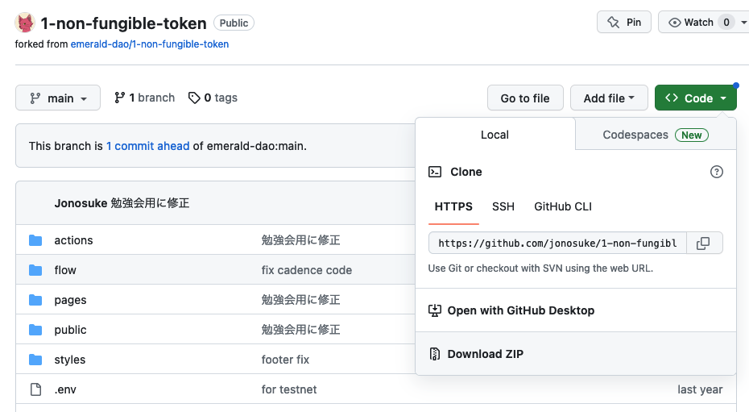
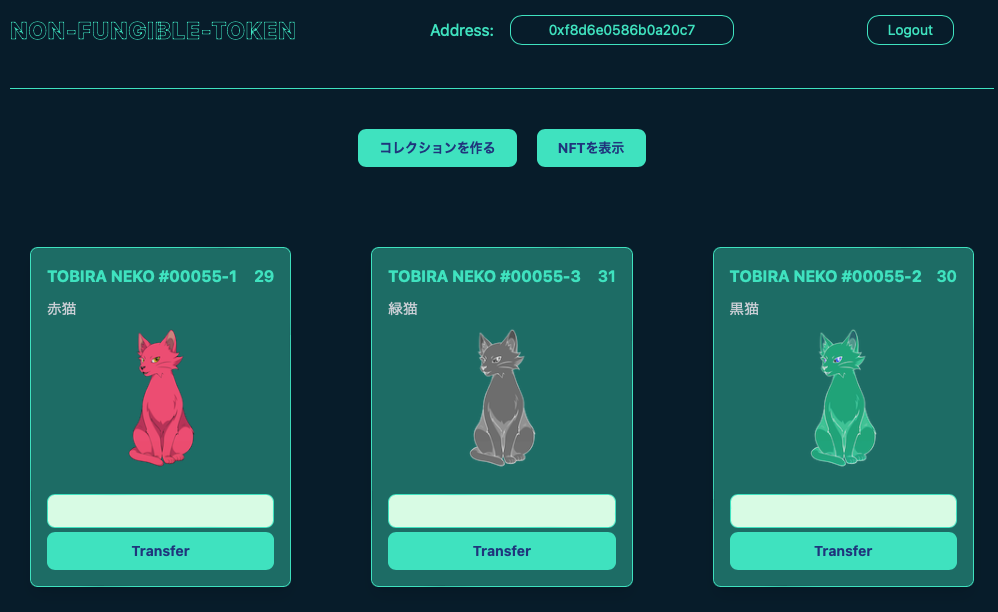

# Flowを触ってみよう
参考サイト: https://academy.ecdao.org/en/quickstarts/1-non-fungible-token
## はじめに
NFTは触った事すらない、という人が多いと思うので、とりあえずFlowを触ってみよう、という趣旨でやろうと思っています。

とりあえず触るだけです。深い話はしません(できません)。

実際に取引がされているFlowを触るとお金がかかってしまうので、Flowのエミューレーターを使って、自分のパソコンで動かします。

やり方についてはWindowsを想定して書いています。

Flowの勉強を始めるきっかけになれば幸いです。
## この勉強会でやる事
- 必要なもののインストール
- エミューレーターの起動
- コレクションの作成
- NFTのミント
- NFTを他の人に送る
- 取引の履歴を追跡
## 必要なもののインストール
### Node.jsのインストール
バージョン16が推奨のようです。

https://nodejs.org/dist/latest-v16.x/node-v16.20.1-x86.msi

### Flow CLIのインストール
https://developers.flow.com/tooling/flow-cli/install

1. `PowerShell`を起動
2. `iex "& { $(irm 'https://raw.githubusercontent.com/onflow/flow-cli/master/install.ps1') }"
   `を実行

### 勉強会用のプログラムのダウンロード
#### Gitが使える場合
`git clone https://github.com/emerald-dao/1-non-fungible-token.git`
#### Gitが使えない場合
下記サイトに移動→緑色の`Code`をクリック→`Download ZIP`をクリックしてダウンロードし、適当な所に展開してください。

https://github.com/jonosuke/1-non-fungible-token



この後の作業は、基本的に全て1-non-fungible-tokenフォルダ(ZIPを展開した場合は1-non-fungible-token-mainフォルダ)の中で行います。

## エミューレーターの起動
### 勉強会用のアプリを起動

ターミナルかPowerShellで下記を実行
```
cd (gitを実行した場所)/1-non-fungible-token # ZIPを展開した場合は 「cd (ZIPを展開した場所)/1-non-fungible-token-main」
npm install
npm run dev
```

### Flowエミュレーターを起動
新しく別のターミナルかPowerShellを起動して下記を実行
```
cd (gitを実行した場所)/1-non-fungible-token # ZIPを展開した場合は 「cd (ZIPを展開した場所)/1-non-fungible-token-main」
flow emulator start -v
```

### ウォレットを起動
新しく別のターミナルかPowerShellを起動して下記を実行
```
cd (gitを実行した場所)/1-non-fungible-token # ZIPを展開した場合は 「cd (ZIPを展開した場所)/1-non-fungible-token-main」
flow dev-wallet
```

### エミュレーターに勉強会用のプログラムを反映
新しく別のターミナルかPowerShellを起動して下記を実行
```
cd (gitを実行した場所)/1-non-fungible-token # ZIPを展開した場合は 「cd (ZIPを展開した場所)/1-non-fungible-token-main」
flow project deploy
```
flow/cadenceフォルダにあるプログラムを修正した場合は、その都度`flow project deploy`を実行してエミュレーターに反映させてください。

## コレクションの作成
NFTを管理するために、コレクションというものを作ります。NFTの入れ物みたいなものです。コレクションはNFTの種類毎に作る必要があります。

1. ブラウザで`http://localhost:3000`を開く
2. ブラウザの右上にある「Connect」をクリック
3. 「Service Account」をクリック
4. 「コレクションを作る」をクリック
5. 「APPROVE」をクリック

## NFTのミント
ミントとは、NFTを作る事です。

新しく別のターミナルかPowerShellを起動して下記を実行して下さい。
```
cd (gitを実行した場所)/1-non-fungible-token # ZIPを展開した場合は 「cd (ZIPを展開した場所)/1-non-fungible-token-main」
npm run mint 0xf8d6e0586b0a20c7
```
0xf8d6e0586b0a20c7はユーザIDみたいなものです。ブラウザの中央上に「Address」として表示されています。

ブラウザの画面に戻り、「NFTを表示」をクリックすると、先ほどミントしたNFTが表示されます。


## NFTを他の人に送る
まずは、送り先のアカウントを作成します。
1. ブラウザの右上にある「Logout」をクリック
2. ブラウザの右上にある「Connect」をクリック
3. 「Create New Account」をクリック
4. 「CREATE」をクリック
5. 「Account A」をクリック
これで「Account A」でログインできました。

次に、Account Aでコレクションを作ります。
1. 「コレクションを作る」をクリック
2. 「APPROVE」をクリック

元のアカウントからAccount AにNFTを送りたいので、元のアカウントに戻ります。

1. ブラウザの右上にある「Logout」をクリック
2. ブラウザの右上にある「Connect」をクリック
3. 「Service Account」をクリック

Account AにNFTを送ります。
1. 「NFTを表示」をクリック
2. 送りたいNFTに`0x179b6b1cb6755e31`を入力し、「Transfer」をクリック
3. 「APPROVE」をクリック
4. 「NFTを表示」をクリック

送ったNFTが消えたはずです。

では、送られたNFTを確認するために、Account Aに戻りましょう。

1. ブラウザの右上にある「Logout」をクリック
2. ブラウザの右上にある「Connect」をクリック
3. 「Account A」をクリック
4. 「NFTを表示」をクリック

送られたNFTが表示されているはずです。

## 取引の履歴を追跡
ブロックチェーンと言えば、履歴の追跡です。最初のアカウントからAccount Aに送ったNFTの履歴を追跡してみましょう。

### ブロック情報の表示
`flow emulator start -v`を実行したウィンドウでログを遡り、下記のようなログを探します。
```
10:47PM DBG ✉️   Transaction submitted                   txID=5bbda4983d374c525caaa325499e4efd42849e0a5c8c3202a2087a6bd96d0257
10:47PM DBG ⭐  Transaction executed                      computationUsed=20 txID=5bbda4983d374c525caaa325499e4efd42849e0a5c8c3202a2087a6bd96d0257
10:47PM DBG EVT [5bbda4] A.f8d6e0586b0a20c7.ExampleNFT.Withdraw: 0x888eb197ef39f52358fbec3e358071d3e4d3f2fe8c67be75038e430ff069e639
10:47PM DBG EVT [5bbda4] A.f8d6e0586b0a20c7.ExampleNFT.Deposit: 0xd14feabab497c973922d5941e172fc738e37820ecdc74e4bf395e3a243061d3b
10:47PM DBG 📦 Block #9 committed                         blockHeight=9 blockID=80809695385e82cc4fe029ddbd70a2ef2d18ba6293ca33aa65109d0ecd19522c
```
最後の行にあるblockIDの値をコピーして、下記のコマンドを実行します。勉強会用のプログラムがあるフォルダの中で実行しないといけない事に注意してください。また、blockIDは人によって違うので、自分のログの値を使ってください。
```
flow blocks get 80809695385e82cc4fe029ddbd70a2ef2d18ba6293ca33aa65109d0ecd19522c --include transactions
```
下記のようなブロックの情報が表示されます。情報の中身は人によって違うので、一例と思ってください。
```
Block ID                80809695385e82cc4fe029ddbd70a2ef2d18ba6293ca33aa65109d0ecd19522c
Parent ID               496ce37ba5d1a3438afe519c5ae564fbc8252a8bb14c94fd1cfc19f6132afee7
Proposal Timestamp      2023-07-10 13:47:05.639574 +0000 UTC
Proposal Timestamp Unix 1688996825
Height                  9
Status                  Sealed
Total Seals             0
Total Collections       1
    Collection 0:       56626efcd0c90185db6a13f64d092b009d2a6de89651f347cd0fe78b0be4d1ba
         Transaction 0: 5bbda4983d374c525caaa325499e4efd42849e0a5c8c3202a2087a6bd96d0257
```
### 取引の情報の表示
次に、このブロックに記録されている取引の情報を表示してみましょう。

「Transaction 0」の値をコピーして、下記のコマンドを実行します。勉強会用のプログラムがあるフォルダの中で実行しないといけない事に注意してください。また、「Transaction 0」の値は人によって違うので、自分のログの値を使ってください。
```
flow transactions get 5bbda4983d374c525caaa325499e4efd42849e0a5c8c3202a2087a6bd96d0257 --include code
```
下記のような取引の情報が表示されます。
```
Block ID        80809695385e82cc4fe029ddbd70a2ef2d18ba6293ca33aa65109d0ecd19522c
Block Height    9
Status          ✅ SEALED
ID              5bbda4983d374c525caaa325499e4efd42849e0a5c8c3202a2087a6bd96d0257
Payer           f8d6e0586b0a20c7
Authorizers     [f8d6e0586b0a20c7]

Proposal Key:
    Address     f8d6e0586b0a20c7
    Index       0
    Sequence    7

No Payload Signatures

Envelope Signature 0: f8d6e0586b0a20c7
Signatures (minimized, use --include signatures)


Events:          
    Index       0
    Type        A.f8d6e0586b0a20c7.ExampleNFT.Withdraw
    Tx ID       5bbda4983d374c525caaa325499e4efd42849e0a5c8c3202a2087a6bd96d0257
    Values
                - id (UInt64): 31
                - from (Address?): 0xf8d6e0586b0a20c7

    Index       1
    Type        A.f8d6e0586b0a20c7.ExampleNFT.Deposit
    Tx ID       5bbda4983d374c525caaa325499e4efd42849e0a5c8c3202a2087a6bd96d0257
    Values
                - id (UInt64): 31
                - to (Address?): 0x179b6b1cb6755e31
(以下省略)
```
Withdrawが引き出しで、Depositが預け入れです。0xf8d6e0586b0a20c7(元のアカウント)から「id 31」のNFTが引き出されて、0x179b6b1cb6755e31(Account A)に預け入れられていることがわかります。

### ブロックを遡る
ブロック情報にある「Parent ID」が、一つ前のブロックのIDです。このIDを使って、一つ前のブロックの情報を表示してみましょう(勉強会用のプログラムがあるフォルダの中で実行しないといけない事に注意してください)。
```
flow blocks get 496ce37ba5d1a3438afe519c5ae564fbc8252a8bb14c94fd1cfc19f6132afee7 --include transactions
```
下記のようなブロックの情報が表示されます。
```
Block ID                496ce37ba5d1a3438afe519c5ae564fbc8252a8bb14c94fd1cfc19f6132afee7
Parent ID               6cd3f8fefbeae519c26fae53dc8ff01d7c7ff57147d673f8d799d31c1b2aa3b2
Proposal Timestamp      2023-07-10 13:46:59.745497 +0000 UTC
Proposal Timestamp Unix 1688996819
Height                  8
Status                  Sealed
Total Seals             0
Total Collections       1
    Collection 0:       c73a82d170f6d77480328659888867768ca2d2d6875cd81c0e434a6d3631c1c5
         Transaction 0: e511153bfe23392842fd907cfe8d284f91f16bf997b15cb1979b5d0577589e4a
```
取引の情報を表示してみましょう。勉強会用のプログラムがあるフォルダの中で実行しないといけない事に注意してください。
```
flow transactions get e511153bfe23392842fd907cfe8d284f91f16bf997b15cb1979b5d0577589e4a --include code
```
下記のような取引の情報が表示されます。ブロックの履歴には全ての操作が残るので、人によって残っている履歴が違います。あくまで例として見て下さい。
```
Block ID        496ce37ba5d1a3438afe519c5ae564fbc8252a8bb14c94fd1cfc19f6132afee7
Block Height    8
Status          ✅ SEALED
ID              e511153bfe23392842fd907cfe8d284f91f16bf997b15cb1979b5d0577589e4a
Payer           179b6b1cb6755e31
Authorizers     [179b6b1cb6755e31]

(省略)

Code


      import ExampleNFT from 0xf8d6e0586b0a20c7
      import NonFungibleToken from 0xf8d6e0586b0a20c7
      import MetadataViews from 0xf8d6e0586b0a20c7

      transaction() {
        
        prepare(signer: AuthAccount) {
          destroy signer.load<@NonFungibleToken.Collection>(from: ExampleNFT.CollectionStoragePath)
          signer.unlink(ExampleNFT.CollectionPublicPath)
          if signer.borrow<&ExampleNFT.Collection>(from: ExampleNFT.CollectionStoragePath) == nil {
            signer.save(<- ExampleNFT.createEmptyCollection(), to: ExampleNFT.CollectionStoragePath)
            signer.link<&ExampleNFT.Collection{NonFungibleToken.CollectionPublic, MetadataViews.ResolverCollection}>(ExampleNFT.CollectionPublicPath, target: ExampleNFT.CollectionStoragePath)
          }
        }

        execute {
          
        }
      }
(以下省略)
```
解りづらいですが、Playerが179b6b1cb6755e31(Account A)で、Codeを見ると「ExampleNFT.createEmptyCollection()」と言うのが見えるので、Account Aがコレクションを作った履歴である事が判ります。

こんな感じでどんどん遡っていけば、全ての操作の履歴を見る事が出来ます。

真面目に遡っていくと時間がかかるので、`flow emulator start -v`を実行したウィンドウでログを遡り、下記のようなログを探します。
```
10:46PM DBG ✉️   Transaction submitted                   txID=05f9ccc603738dcee25ffcb22d12c9ab69f334b20359e0e4b4c131b8df5b9843
10:46PM DBG ⭐  Transaction executed                      computationUsed=60 txID=05f9ccc603738dcee25ffcb22d12c9ab69f334b20359e0e4b4c131b8df5b9843
10:46PM DBG EVT [05f9cc] A.f8d6e0586b0a20c7.ExampleNFT.Deposit: 0x8b9acc75fd404955efbae7c303c40522f90bd068f996449dad9378ebb77d94c0
10:46PM DBG EVT [05f9cc] A.f8d6e0586b0a20c7.ExampleNFT.Deposit: 0xf3837c54506d19599dd16ebb5539ecdc20110fea8375fb531fa8e4c8edc564d7
10:46PM DBG EVT [05f9cc] A.f8d6e0586b0a20c7.ExampleNFT.Deposit: 0xa8ab29c2eab0408d760a264b1fbabc46dd1ee5d1ab7d79c6d201ad6ea28dc1a8
10:46PM DBG 📦 Block #6 committed                         blockHeight=6 blockID=762cdfaafe36cf663d240260a7f554527d59f279d6c9433594b18b0dc4bcc928
```
このログは、最初にNFTをミントしたときのログです。取引の情報を表示してみましょう。勉強会用のプログラムがあるフォルダの中で実行しないといけない事に注意してください。
```
flow transactions get 05f9ccc603738dcee25ffcb22d12c9ab69f334b20359e0e4b4c131b8df5b9843 --include code
```
下記のような取引の情報が表示されます。
```
Block ID        762cdfaafe36cf663d240260a7f554527d59f279d6c9433594b18b0dc4bcc928
Block Height    6
Status          ✅ SEALED
ID              05f9ccc603738dcee25ffcb22d12c9ab69f334b20359e0e4b4c131b8df5b9843
Payer           f8d6e0586b0a20c7
Authorizers     [f8d6e0586b0a20c7]

Proposal Key:
    Address     f8d6e0586b0a20c7
    Index       0
    Sequence    5

No Payload Signatures

Envelope Signature 0: f8d6e0586b0a20c7
Signatures (minimized, use --include signatures)

Events:          
    Index       0
    Type        A.f8d6e0586b0a20c7.ExampleNFT.Deposit
    Tx ID       05f9ccc603738dcee25ffcb22d12c9ab69f334b20359e0e4b4c131b8df5b9843
    Values
                - id (UInt64): 29 
                - to (Address?): 0xf8d6e0586b0a20c7 

    Index       1
    Type        A.f8d6e0586b0a20c7.ExampleNFT.Deposit
    Tx ID       05f9ccc603738dcee25ffcb22d12c9ab69f334b20359e0e4b4c131b8df5b9843
    Values
                - id (UInt64): 30 
                - to (Address?): 0xf8d6e0586b0a20c7 

    Index       2
    Type        A.f8d6e0586b0a20c7.ExampleNFT.Deposit
    Tx ID       05f9ccc603738dcee25ffcb22d12c9ab69f334b20359e0e4b4c131b8df5b9843
    Values
                - id (UInt64): 31 
                - to (Address?): 0xf8d6e0586b0a20c7 
(途中省略)
        execute {
          var i = 0
          while i < names.length {
            ExampleNFT.mintNFT(recipient: self.RecipientCollection, name: names[i], description: descriptions[i], thumbnail: thumbnails[i])
            i = i + 1
          }
        }
(以下省略)
```
ミントされている事と、0xf8d6e0586b0a20c7(元のアカウント)に三つのNFTが預け入れされてる事が判ります。これで、ミントされてからAccount Aに預け入れされるまでの履歴を追う事が出来ました。
